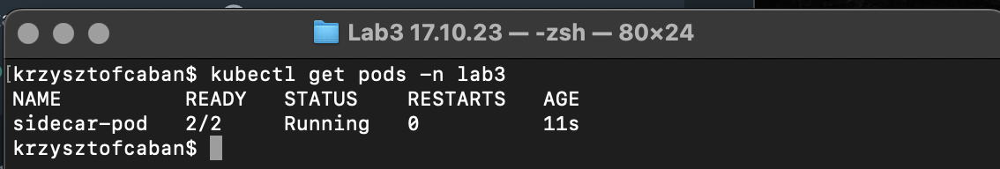
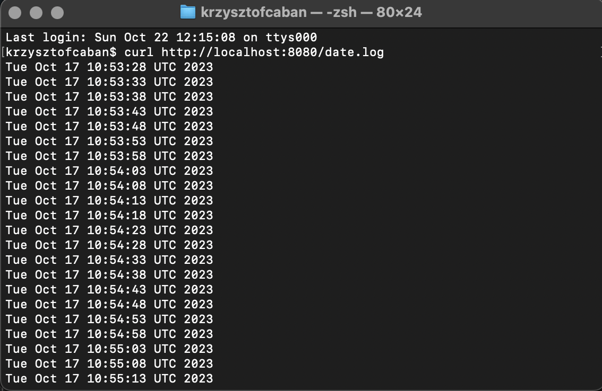

## Plik yaml
```
apiVersion: v1
kind: Pod
metadata:
  name: sidecar-pod
  namespace: lab3
spec:
  containers:
    - name: busybox-container
      image: busybox
      command:
        - "sh"
        - "-c"
        - "while true; do date >> /var/log/date.log; sleep 5; done"
      volumeMounts:
        - name: shared-volume
          mountPath: /var/log

    - name: nginx-container
      image: nginx
      volumeMounts:
        - name: shared-volume
          mountPath: /usr/share/nginx/html

  volumes:
    - name: shared-volume
      hostPath:
        path: /var/log

```

## Tworzenie poda
```
kubectl apply -f sidecar-pod.yaml
```

## Sprawdzenie czy pod został utworzony


## Port-forwarding dla kontenera nginx
```
kubectl port-forward -n lab3 sidecar-pod 8080:80
```

## Sprawdzenie czy logi faktycznie są zapisywane
```
curl http://localhost:8080/date.log
```


