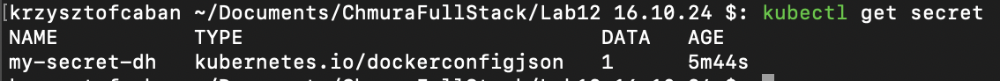
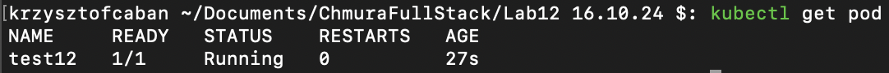
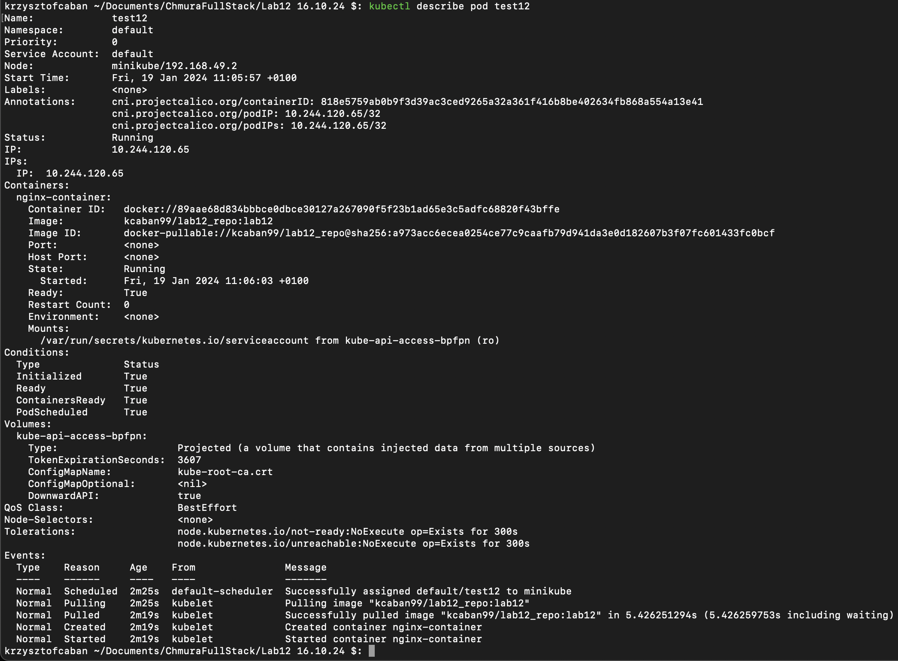

## Plik dockerfile
```yaml
FROM nginx:latest
```

## Budowanie obrazu
```zsh
docker build -t kcaban99/lab12_repo:lab12 .
docker push kcaban99/lab12_repo:lab12
```

## plik yaml
```yaml
apiVersion: v1
kind: Pod
metadata:
  name: test12
spec:
  containers:
  - name: nginx-container
    image: kcaban99/lab12_repo:lab12
  imagePullSecrets:
  - name: my-secret-dh
```


## tworzenie obiektu secret
```zsh
kubectl create secret docker-registry my-secret-dh --docker-server=https://index.docker.io/v1/ --docker-username=kcaban99 --docker-password=<<DOCKERHUB_TOKEN>>
```

## sprawdzenie poprawności zapisania secretu
```zsh
kubectl get secret
```


## uruchomienie poda
```zsh
kubectl apply -f test12.yaml
```

## sprawdzenie poprawności działania
```zsh
kubectl get pod
```


```zsh
kubectl describe pod test12
kubectl describe pod test12 > dsc_pod.yaml
```

[describe.yaml](dsc_pod.yaml)