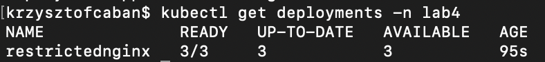

## Plik yaml
```
apiVersion: v1
kind: List
items:


  - apiVersion: v1
    kind: Namespace
    metadata:
      name: lab4

  - apiVersion: v1
    kind: ResourceQuota
    metadata:
      name: lab4-resource-quota
      namespace: lab4
    spec:
      hard:
        pods: "5"
        limits.cpu: "1000m"
        limits.memory: "1Gi"

  - apiVersion: apps/v1
    kind: Deployment
    metadata:
      name: restrictednginx
      namespace: lab4
    spec:
      replicas: 3
      selector:
        matchLabels:
          app: restrictednginx
      template:
        metadata:
          labels:
            app: restrictednginx
        spec:
          containers:
          - name: nginx
            image: nginx
            resources:
              limits:
                memory: "256Mi"
                cpu: "250m"
              requests:
                memory: "64Mi"
                cpu: "125m"

```

## Deployment start
```
kubectl apply -f lab4-setup.yaml
```

## Sprawdzenie, czy deployment został uruchomiony poprawnie
```
kubectl get deployments -n lab4
```


## Sprawdzenie poprawności konfiguracji
```
kubectl describe namespace lab4 > dsc_namespace.yaml  

kubectl describe resourcequotas lab4-resource-quota -n lab4 > dsc_resourcequota.yaml   

kubectl describe deployments restrictednginx -n lab4 > dsc_deployment.yaml 

kubectl describe pods -n lab4 > dsc_pods.yaml  
```
