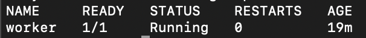

### Plik zbiorczy yaml
```
apiVersion: v1
kind: Namespace
metadata:
  name: lab5

---

apiVersion: v1
kind: ResourceQuota
metadata:
  name: quota-lab5
  namespace: lab5
spec:
  hard:
    pods: "10"
    cpu: "2"
    memory: 1.5Gi

---

apiVersion: v1
kind: Pod
metadata:
  name: worker
  namespace: lab5
spec:
  containers:
  - name: nginx-container
    image: nginx
    resources:
      limits:
        memory: 200Mi
        cpu: 200m
      requests:
        memory: 100Mi
        cpu: 100m

---

apiVersion: apps/v1
kind: Deployment
metadata:
  name: php-apache
  namespace: lab5
spec:
  selector:
    matchLabels:
      run: php-apache
  template:
    metadata:
      labels:
        run: php-apache
    spec:
      containers:
      - name: php-apache
        image: registry.k8s.io/hpa-example
        ports:
        - containerPort: 80
        resources:
          limits:
            memory: 250Mi 
            cpu: 250m
          requests:
            memory: 150Mi 
            cpu: 150m

---

apiVersion: v1
kind: Service
metadata:
  name: php-apache
  namespace: lab5 
  labels:
    run: php-apache
spec:
  ports:
  - port: 80
  selector:
    run: php-apache

---

apiVersion: autoscaling/v1
kind: HorizontalPodAutoscaler
metadata:
  name: php-apache
spec:
  scaleTargetRef:
    apiVersion: apps/v1
    kind: Deployment
    name: php-apache
  minReplicas: 1
  maxReplicas: 5
  targetCPUUtilizationPercentage: 50

```

# Wybór liczby maxReplicas
Po przeliczeniu dostępnych zasobów ResourceQuota i uwgzlędniając pod workera, zdecydowano o ustaleniu maksymalnej liczby replik na liczbę 5, dzięki czemu limity ResourceQuota nie zostaną przekroczone.

### Sprawdzenie poprawności uruchomienia
#### namespace
```
kubectl get ns
kubectl describe namespace lab5 > dsc_namespace.yaml
```


#### resourcequota
```
kubectl describe resourcequotas quota-lab5 -n lab5
```


#### pod workera
```
kubectl get pods -n lab5 worker
kubectl describe pod worker -n lab5 > dsc_worker.yaml
```


#### deployment
```
kubectl get deployment -n lab5
kubectl describe deployment php-apache -n lab5 > dsc_deployment.yaml
```


#### service
```
kubectl get service -n lab5
kubectl describe service php-apache -n lab5 > dsc_service.yaml
```


#### autoscaler
```
kubectl get hpa -n lab5
kubectl describe hpa php-apache -n lab5 > dsc_hpa.yaml
```


### Sprawdzenie działania autoscalera pod obciążeniem
```
kubectl get hpa -n lab5
```

Widzimy, zwiększenie się ilośc replic do 4.
