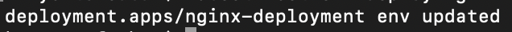
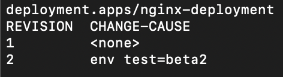

## Plik yaml
```yaml
apiVersion: apps/v1
kind: Deployment
metadata:
  name: nginx-deployment
  labels:
    app: nginx
    type: proxy
  annotations:
    version: "1.0"
spec:
  replicas: 5
  selector:
    matchLabels:
      app: nginx
  template:
    metadata:
      labels:
        app: nginx
    spec:
      containers:
      - name: nginx
        image: nginx:1.9
        ports:
        - containerPort: 80
  strategy:
    type: RollingUpdate
    rollingUpdate:
      maxUnavailable: 2
      maxSurge: 1
```

## Sprawdzenie poprawności uruchomienia
```zsh
kubectl get all --selector app=nginx -n lab6
```

## Przykładowe polecenie wymuszające wykonanie update
```zsh
kubectl set env deploy nginx-deployment -n lab6 test=beta2
```


## Dodanie annotate
```zsh
kubectl annotate deployment nginx-deployment -n lab6 kubernetes.io/change-cause="env test=beta2"
```


## Sprawdzenie historii aktualizacji
```zsh
kubectl rollout history deployment nginx-deployment -n lab6
```
